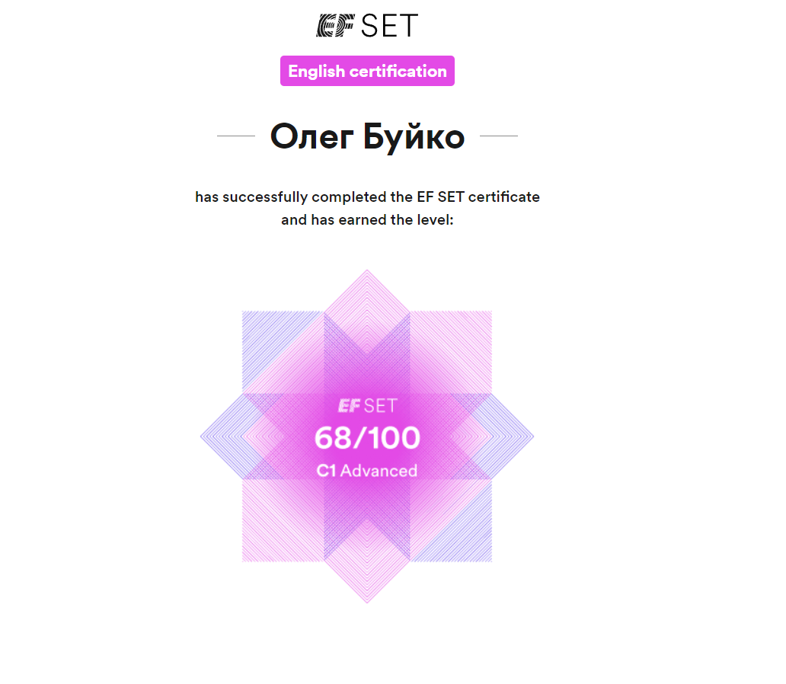

## [rsschool-cv](https://olezhaaa137.github.io/rsschool-cv/)

# Oleg Buiko

### Junior Frontend Developer

---

### Contact information:<br/>
* Phone: +375 44 111-55-55
* email: <oleshkabyiko@gmail.com>
* [LinkedIn](https://www.linkedin.com/in/oleg-buiko-0b995b290/)
* GitHub - [olezhaaa137](https://github.com/olezhaaa137)
* Discord - olegbuiko

### About myself:<br/>
I am a fourth-year student at the Belarusian State University of Informatics and Radioelectronics, majoring in Information Systems and Technologies. I have a strong passion for Java application development and I am eager to pursue a career in this field while continuously expanding my knowledge of new technologies. As a motivated individual, I thrive on tackling complex problems and finding innovative solutions. I am excited about the opportunity to contribute as an intern or junior Java backend developer.

### Skills:<br/>
* Java
* HTML5, CSS3
* Git, GitHub
* Maven
* Spring MVC basics

---

### Code example: 

**Peak array index KATA from CODEWARS:** _Given an array of ints, return the index such that the sum of the elements to the right of that index equals the sum of the elements to the left of that index. If there is no such index, return -1. If there is more than one such index, return the left-most index._<br/>
```
function peak(arr) {

  for (let i = 1; i < arr.length - 1; i++) {
    let leftSum = arr.slice(0, i).reduce((accumulator, currentValue) => accumulator + currentValue);
    let rightSum = arr.slice(i + 1).reduce((accumulator, currentValue) => accumulator + currentValue);
    if (leftSum === rightSum) {
      return i;
    }
  }
  return -1;
}
```

### Experience

### Education
* Belarusian State University of Informatics and Radioelectronics (engineer-programmer-economist)
* JavaScript Manual on learnjavascript.ru(https://learn.javascript.ru/) (in progress)
* RS Schools Course «JavaScript/Front-end. Stage 0» (in progress)

### English
* _Advanced_ (accroding to the [EFSet](https://www.efset.org/) test)<br/>

* Russian - Native
* Belarusian - Advanced
